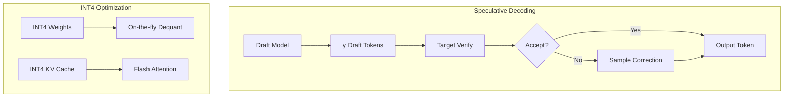
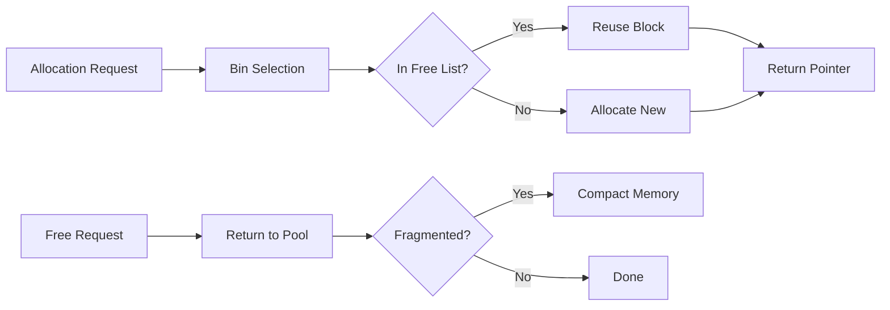

# Cogito

*"Cogito, ergo sum" — I think, therefore I am.*

A minimal, educational C machine learning library built from scratch. **10,000+ lines** of pure C implementing PyTorch 2.0-style features.

## Features

### Core
- **Tensor System** - N-dimensional tensors with autograd
- **JIT Compiler** - Graph capture + C/CUDA code generation
- **Symbolic Shapes** - Dynamic dimensions with constraints

### Training
- **Mixed Precision** - BF16 with dynamic loss scaling
- **Optimizers** - SGD (momentum/Nesterov), Adam
- **Loss Functions** - MSE, Cross-Entropy, BCE, L1, Huber

### Attention
- **Flash Attention v2** - O(N) memory, tiled algorithm
- **RoPE** - Rotary positional embeddings
- **ALiBi** - Attention with linear biases
- **MQA/GQA** - Multi/grouped query attention

### Inference
- **INT4 Quantization** - Per-group scales, KV cache
- **Speculative Decoding** - Draft + verify, EAGLE-style
- **Sampling** - Top-p, top-k, temperature

### Systems
- **Kernel Fusion** - Automatic pattern matching
- **Memory Planner** - Binned allocation, defragmentation
- **Pipeline Parallelism** - 1F1B schedule, 3D parallel

---

## Architecture

```mermaid
graph TB
    subgraph Core["Core Engine"]
        tensor[Tensor] --> autograd[Autograd]
        autograd --> graph[Computational Graph]
    end
    
    subgraph JIT["JIT Compiler"]
        trace[Graph Capture] --> ir[IR Optimization]
        ir --> fusion[Kernel Fusion]
        fusion --> codegen[C/CUDA Codegen]
    end
    
    subgraph Layers["Neural Networks"]
        linear[Linear] --> conv[Conv2D]
        act[Activations] --> norm[BatchNorm]
    end
    
    Core --> JIT
    Core --> Layers
```

## Training Pipeline


## Inference Pipeline



## Memory System



---

## Quick Start

```bash
# Build
mkdir build && cd build
cmake ..
cmake --build . --config Release

# Run tests
ctest -C Release --output-on-failure

# Run examples
./Release/xor_example
./Release/mnist_example
```

## Example: XOR

```c
#include "cogito.h"

int main(void) {
    cg_sequential* model = cg_sequential_new();
    cg_sequential_add(model, (cg_layer*)cg_linear_new(2, 4, true));
    cg_sequential_add(model, (cg_layer*)cg_relu_new());
    cg_sequential_add(model, (cg_layer*)cg_linear_new(4, 1, true));
    cg_sequential_add(model, (cg_layer*)cg_sigmoid_new());
    
    cg_sgd* opt = cg_sgd_new_for_sequential(model, 0.5f, 0.9f, 0, false);
    
    for (int epoch = 0; epoch < 5000; epoch++) {
        cg_tensor* pred = cg_sequential_forward(model, X);
        cg_tensor* loss = cg_mse_loss(pred, y, CG_REDUCTION_MEAN);
        cg_optimizer_zero_grad((cg_optimizer*)opt);
        cg_backward(loss);
        cg_optimizer_step((cg_optimizer*)opt);
    }
    return 0;
}
```

---

## Project Structure

```
cogito/
├── include/
│   ├── cogito.h          # Main umbrella header
│   ├── cg_tensor.h       # Tensors + broadcasting
│   ├── cg_layers.h       # NN layers + Conv2D
│   ├── cg_jit.h          # JIT compiler + IR
│   ├── cg_symbolic.h     # Dynamic shapes
│   ├── cg_bf16.h         # Mixed precision
│   ├── cg_flash_attn.h   # Flash Attention v2
│   ├── cg_fusion.h       # Kernel fusion
│   ├── cg_memory.h       # Memory planner
│   ├── cg_quantize.h     # INT4 quantization
│   ├── cg_speculative.h  # Speculative decoding
│   └── cg_pipeline.h     # 3D parallelism
├── src/
│   ├── core/             # Tensor, autograd, graph, BF16
│   ├── jit/              # Graph capture, fusion
│   ├── attention/        # Flash Attention
│   ├── memory/           # Planner, defrag
│   ├── quantize/         # INT4
│   ├── inference/        # Speculative
│   ├── layers/           # Linear, Conv2D, activations
│   └── optim/            # SGD, Adam
├── examples/
│   ├── xor.c             # XOR function learning
│   └── mnist.c           # MNIST classification
└── tests/
    ├── test_tensor.c     # Tensor unit tests
    └── test_autograd.c   # Gradient verification
```

---

## Design Philosophy

| Aspect | Choice | Rationale |
|--------|--------|-----------|
| Language | C11 | Maximum portability |
| Dependencies | None (optional BLAS) | Educational clarity |
| Memory | Arena + binned pools | Zero fragmentation |
| Errors | `assert()` | Fail-fast for debugging |
| CUDA | Stub implementations | Works without GPU |

---

## Library Statistics

| Metric | Count |
|--------|-------|
| Source files | 24 |
| Headers | 16 |
| Lines of C | ~10,000 |
| Test coverage | Core tensor + autograd |

---

## License

MIT
